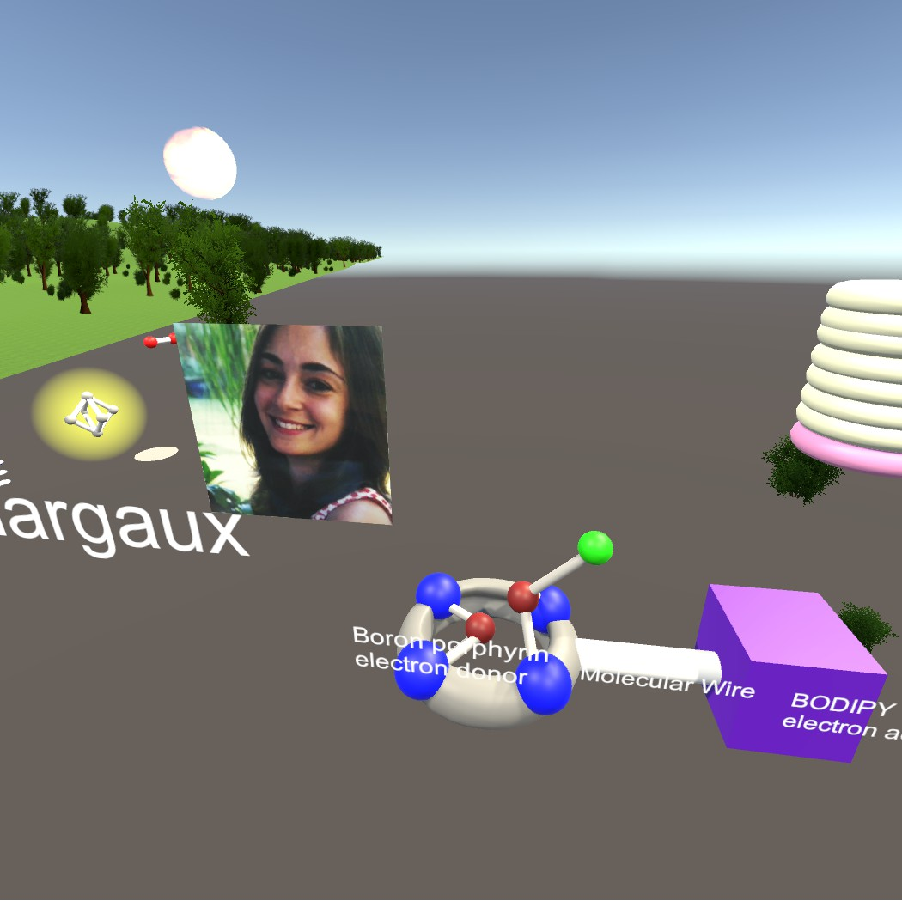
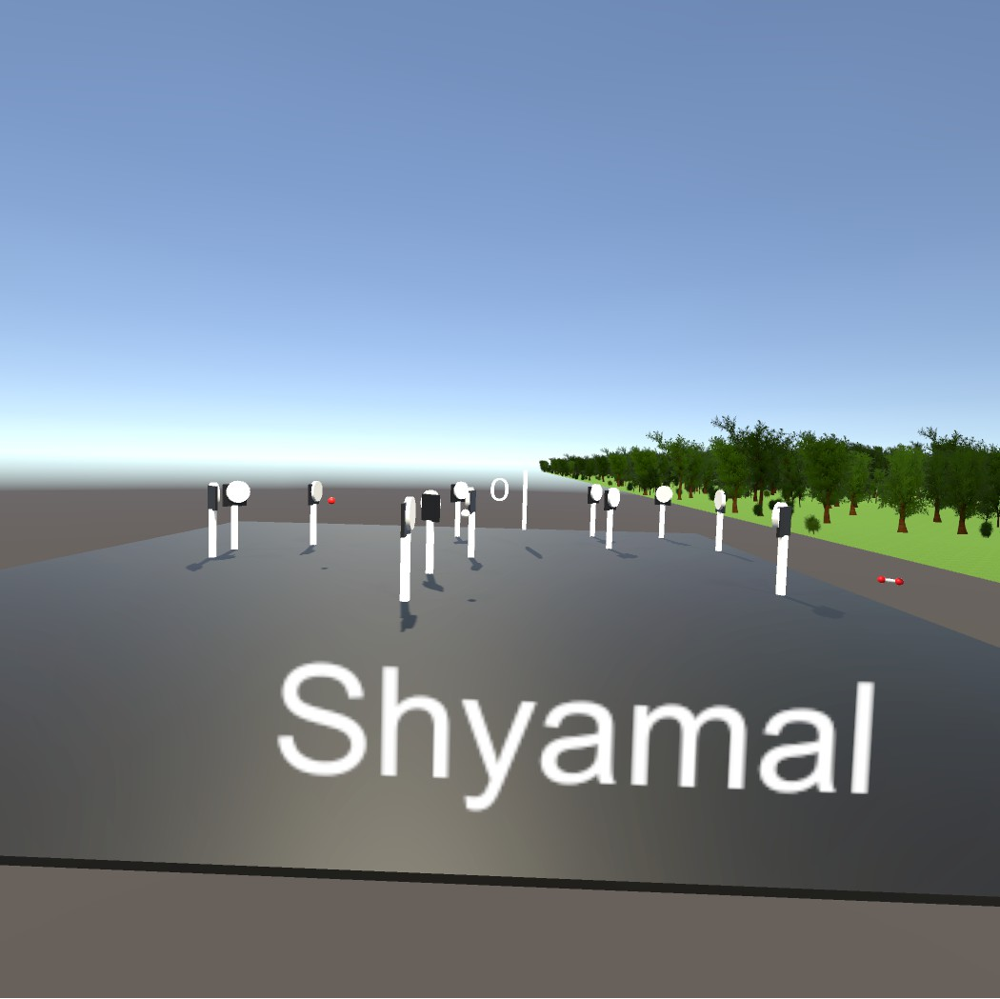
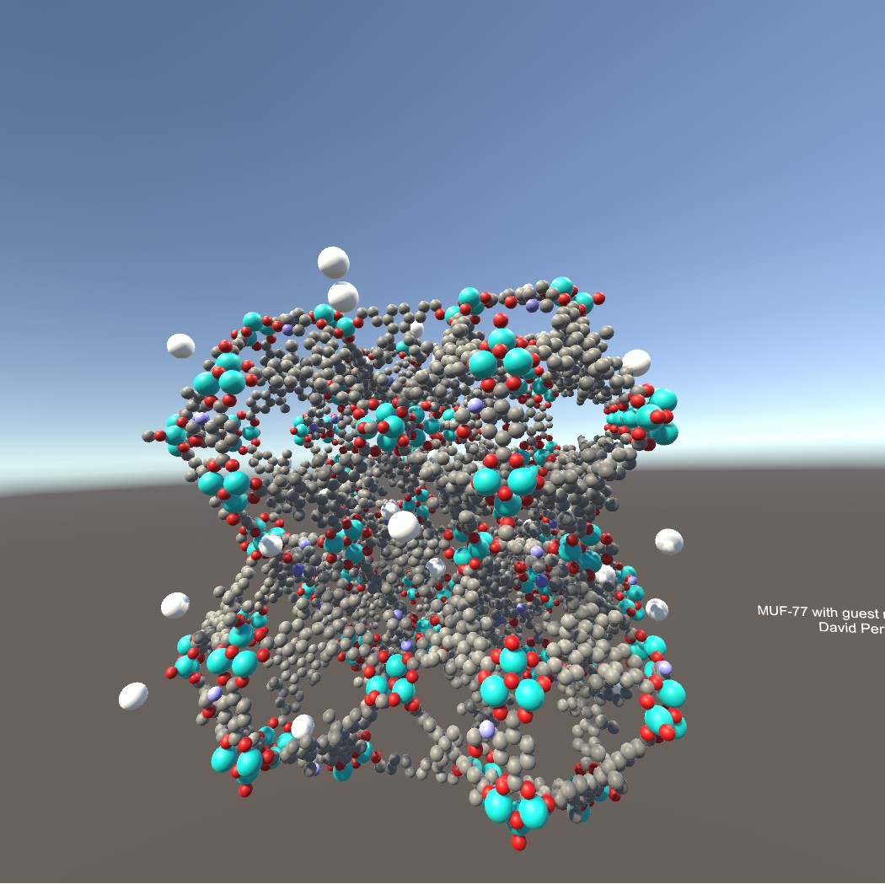

# mesa_vr_workshop

On the 18th of November, 2016, CeR and MESA ran a workshop on Unity and VR (http://mesa.ac.nz/2016/11/virtual-reality-workshop-2016/). This is the result of that workshop.  

If you have an HTC Vive, you can either download this project and build it yourself, or download the latest release: https://github.com/UoA-eResearch/mesa_vr_workshop/releases  

If you don't have a Vive, here's a video of this project and some screenshots: https://www.youtube.com/watch?v=CbB2jD2hEBU  

